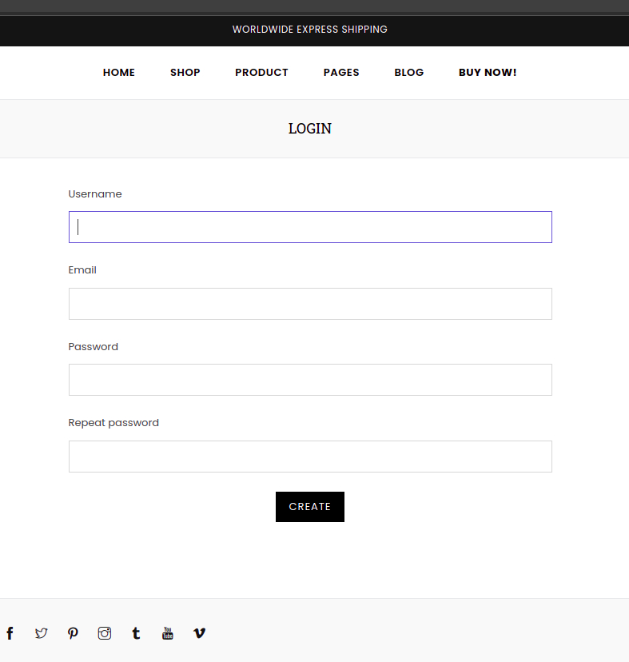

#  Women shop 

#### Tools: Django, Postgresql, Heroku
##### For launching: clone repo, create venv, install dependencies, migrate models, run "python manage.py runserver" command. Or visit shop in Heroku Cloud: https://women-shop-alatoo.herokuapp.com/
admin panel - https://women-shop-alatoo.herokuapp.com/admin
login: admin password: admin

#### Ala-Too logo

#### Main page (clothes be added from admin panel)

#### Ordering (all orders can be checked in admin panel)

#### Login and signup pages

#### Copyright section

#### About us section

